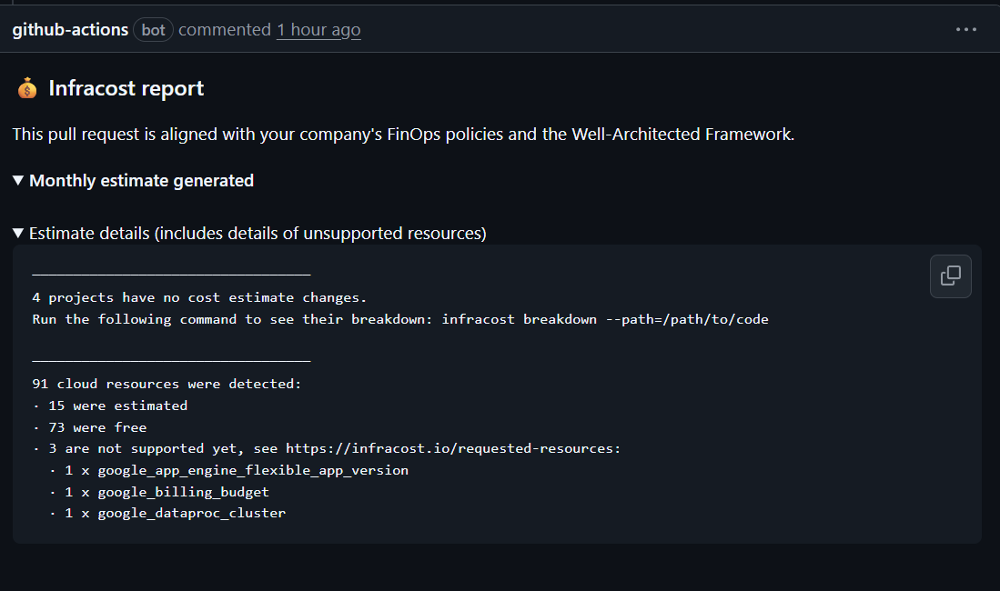
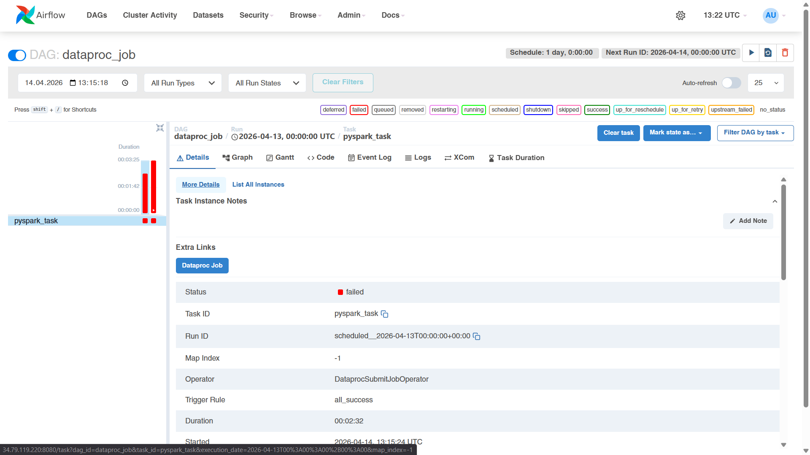
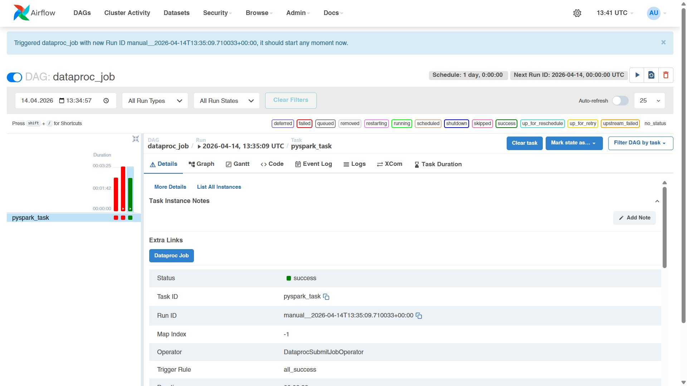

IMPORTANT ❗ ❗ ❗ Please remember to destroy all the resources after each work session. You can recreate infrastructure by creating new PR and merging it to master.


## Phase 1 Exercise Overview

   Legend

   - 🔵 Blue — setup steps (one-time configuration)
   - 🟠 Orange — manual steps (GCP Console / GitHub UI)
   - 🟢 Green — infrastructure ready
   - 🟣 Purple — tasks to complete and document in tasks-phase1.md

1. Authors:

   ***Group number 14***

   [https://github.com/adecku/tbd-workshop-1](https://github.com/adecku/tbd-workshop-1)

2. Follow all steps in README.md.

3. From available Github Actions select and run destroy on master branch.

4. Create new git branch and:
   1. Modify tasks-phase1.md file.

   2. Create PR from this branch to **YOUR** master and merge it to make new release.

   
      

5. Analyze terraform code. Play with terraform plan, terraform graph to investigate different modules.

      #### Dataproc module
      The dataproc module is responsible for setting up a data processing environment in Google Cloud. It creates a Dataproc cluster that can run Spark jobs, along with a service account that has permissions to access resources like BigQuery and Cloud Storage. The module also creates two GCS buckets for staging and temporary data used during job execution. Additionally, it enables the Dataproc API required for the cluster to function. Overall, the module prepares all components needed to process data in the cloud.
      Graph for dataproc module:   

      #### Graph
      ```subgraph "cluster_module.dataproc" {
      subgraph "cluster_module.dataproc" {
            label = "module.dataproc"
            fontname = "sans-serif"
            "module.dataproc.google_dataproc_cluster.tbd-dataproc-cluster" [label="google_dataproc_cluster.tbd-dataproc-cluster"];
            "module.dataproc.google_project_iam_member.dataproc_bigquery_data_editor" [label="google_project_iam_member.dataproc_bigquery_data_editor"];
            "module.dataproc.google_project_iam_member.dataproc_bigquery_user" [label="google_project_iam_member.dataproc_bigquery_user"];
            "module.dataproc.google_project_iam_member.dataproc_worker" [label="google_project_iam_member.dataproc_worker"];
            "module.dataproc.google_project_service.dataproc" [label="google_project_service.dataproc"];
            "module.dataproc.google_service_account.dataproc_sa" [label="google_service_account.dataproc_sa"];
            "module.dataproc.google_storage_bucket.dataproc_staging" [label="google_storage_bucket.dataproc_staging"];
            "module.dataproc.google_storage_bucket.dataproc_temp" [label="google_storage_bucket.dataproc_temp"];
            "module.dataproc.google_storage_bucket_iam_member.staging_bucket_iam" [label="google_storage_bucket_iam_member.staging_bucket_iam"];
            "module.dataproc.google_storage_bucket_iam_member.temp_bucket_iam" [label="google_storage_bucket_iam_member.temp_bucket_iam"];
         }
      ```

6. Reach YARN UI

   ***place the command you used for setting up the tunnel, the port and the screenshot of YARN UI here***
      Hint: the Dataproc cluster has `internal_ip_only = true`, so you need to use an IAP tunnel.
      See: `gcloud compute ssh` with `-- -L <local_port>:localhost:<remote_port>` and `--tunnel-through-iap` flag.
      YARN ResourceManager UI runs on port **8088**.  
   Command used for setting up the tunnel:  
   ```
   gcloud compute ssh tbd-cluster-m  
      --zone europe-west1-b  
      --tunnel-through-iap  
      -- -L 18088:tbd-cluster-m:8088  
   Port: 18088  
   ```
   Screenshot of YARN UI:  
   

7. Draw an architecture diagram (e.g. in draw.io) that includes:
   1. Description of the components of service accounts
   2. List of buckets for disposal

   Diagram:
   

8. Create a new PR and add costs by entering the expected consumption into Infracost
For all the resources of type: `google_artifact_registry_repository`, `google_storage_bucket`
create a sample usage profiles and add it to the Infracost task in CI/CD pipeline. Usage file [example](https://github.com/infracost/infracost/blob/master/infracost-usage-example.yml)

    Expected consumption entered into Infracost usage file:

      ```yaml
      version: 0.1

      resource_usage:
         google_artifact_registry_repository.registry:
            storage_gb: 3

         google_storage_bucket.tbd-code-bucket:
            storage_gb: 1
            monthly_class_a_operations: 200
            monthly_class_b_operations: 1000
            monthly_data_retrieval_gb: 1
            monthly_egress_gb: 1

         google_storage_bucket.tbd-data-bucket:
            storage_gb: 10
            monthly_class_a_operations: 500
            monthly_class_b_operations: 3000
            monthly_data_retrieval_gb: 5
            monthly_egress_gb: 2

         google_storage_bucket.dataproc_staging:
            storage_gb: 5
            monthly_class_a_operations: 500
            monthly_class_b_operations: 2000
            monthly_data_retrieval_gb: 2
            monthly_egress_gb: 1

         google_storage_bucket.dataproc_temp:
            storage_gb: 5
            monthly_class_a_operations: 500
            monthly_class_b_operations: 2000
            monthly_data_retrieval_gb: 2
            monthly_egress_gb: 1
      ```

      Infracost output:
      

9. Find and correct the error in spark-job.py

      After `terraform apply` completes, connect to the Airflow cluster:
      ```bash
      gcloud container clusters get-credentials airflow-cluster --zone europe-west1-b --project PROJECT_NAME
      ```

      Then check the external IP (AIRFLOW_EXTERNAL_IP) of the webserver service:
      kubectl get svc -n airflow airflow-webserver  

      ▎ Note: If EXTERNAL-IP shows , wait a moment and retry — LoadBalancer IP allocation may take 1-2 minutes.

      DAG files are synced automatically from your GitHub repo via git-sync sidecar.
      Airflow variables and the `google_cloud_default` GCP connection are also configured by Terraform.

      a) In the Airflow UI ([http://AIRFLOW_EXTERNAL_IP:8080](http://AIRFLOW_EXTERNAL_IP:8080), login: admin/admin), find the `dataproc_job` DAG, unpause it and trigger it manually.

      

      b) The DAG will fail. Examine the task logs in the Airflow UI to find the root cause.

      ```json
      POST https://storage.googleapis.com/upload/storage/v1/b/tbd-2026l-9010-data/o?ifGenerationMatch=0&uploadType=multipart
      {
      "code": 404,
      "errors": [
         {
            "domain": "global",
            "message": "The specified bucket does not exist.",
            "reason": "notFound"
         }
      ],
      "message": "The specified bucket does not exist."
      }
      ```

      The error was caused by writing the output to a non-existing GCS bucket: `tbd-2026l-9010-data`.  
      I found it by checking the Dataproc driver output log referenced in the Airflow task log. The detailed stack trace showed a `404 Not Found` error with the message `The specified bucket does not exist.`

      c) Fix the error in `modules/data-pipeline/resources/spark-job.py` and re-upload the file to GCS:

      ```bash
      gsutil cp modules/data-pipeline/resources/spark-job.py gs://PROJECT_NAME-code/spark-job.py
      ```
      Then trigger the DAG again from the Airflow UI.

      [Fixed spark-job.py file](modules/data-pipeline/resources/spark-job.py)

      d) Verify the DAG completes successfully and check that ORC files were written to the data bucket:
      ```bash
      gsutil ls gs://PROJECT_NAME-data/data/shakespeare/
      ```

      

11. Create a BigQuery dataset and an external table using SQL

      Using the ORC data produced by the Spark job in task 9, create a BigQuery dataset and an external table.

      Note: the dataset must be created in the same region as the GCS bucket (`europe-west1`), e.g.:
       ```bash
      bq mk --dataset --location=europe-west1 shakespeare
      ```

      Querries used in BigQuery Studio:

      ```sql
      CREATE SCHEMA IF NOT EXISTS `tbd-2026l-318786.shakespeare`
      OPTIONS (
      location = 'europe-west1'
      );
      ```
      output: Ten zbiór danych już istnieje.

      ```sql
      CREATE OR REPLACE EXTERNAL TABLE `tbd-2026l-318786.shakespeare.shakespeare_orc_ext`
      OPTIONS (
      format = 'ORC',
      uris = ['gs://tbd-2026l-318786-data/data/shakespeare/*.orc']
      );
      ```

      output: Ta instrukcja spowodowała utworzenie tabeli o nazwie shakespeare_orc_ext.


      ***why does ORC not require a table schema?***

12. Add support for preemptible/spot instances in a Dataproc cluster

    [modules/dataproc/main.tf](modules/dataproc/main.tf)
    ```terraform
    preemptible_worker_config {
      num_instances = 1
    }
    ```

13. Triggered Terraform Destroy on Schedule or After PR Merge. Goal: make sure we never forget to clean up resources and burn money.

   Add a new GitHub Actions workflow that:
      1. runs terraform destroy -auto-approve
      2. triggers automatically:

         a) on a fixed schedule (e.g. every day at 20:00 UTC)

         b) when a PR is merged to master containing [CLEANUP] tag in title

Steps:
   1. Create file .github/workflows/auto-destroy.yml
   2. Configure it to authenticate and destroy Terraform resources
   3. Test the trigger (schedule or cleanup-tagged PR)

Hint: use the existing `.github/workflows/destroy.yml` as a starting point.

***paste workflow YAML here***
```yaml
name: Auto Destroy
on:
  schedule:
    - cron: '0 20 * * *'
  pull_request:
    types: [closed]
    branches:
      - master

permissions: read-all

jobs:
  destroy-release:
    if: github.event_name == 'schedule' || (github.event.pull_request.merged == true && contains(github.event.pull_request.title, '[CLEANUP]'))
    runs-on: ubuntu-latest
    permissions:
      contents: write
      id-token: write
      pull-requests: write
      issues: write

    steps:
    - uses: 'actions/checkout@v3'
    - uses: hashicorp/setup-terraform@v2
      with:
        terraform_version: 1.11.0
    - id: 'auth'
      name: 'Authenticate to Google Cloud'
      uses: 'google-github-actions/auth@v1'
      with:
        token_format: 'access_token'
        workload_identity_provider: ${{ secrets.GCP_WORKLOAD_IDENTITY_PROVIDER_NAME }}
        service_account: ${{ secrets.GCP_WORKLOAD_IDENTITY_SA_EMAIL }}
    - name: Terraform Init
      id: init
      run: terraform init -backend-config=env/backend.tfvars
    - name: Terraform Destroy
      id: destroy
      run: terraform destroy -no-color -var-file env/project.tfvars -auto-approve
      continue-on-error: false
```

***paste screenshot/log snippet confirming the auto-destroy ran***

***write one sentence why scheduling cleanup helps in this workshop***