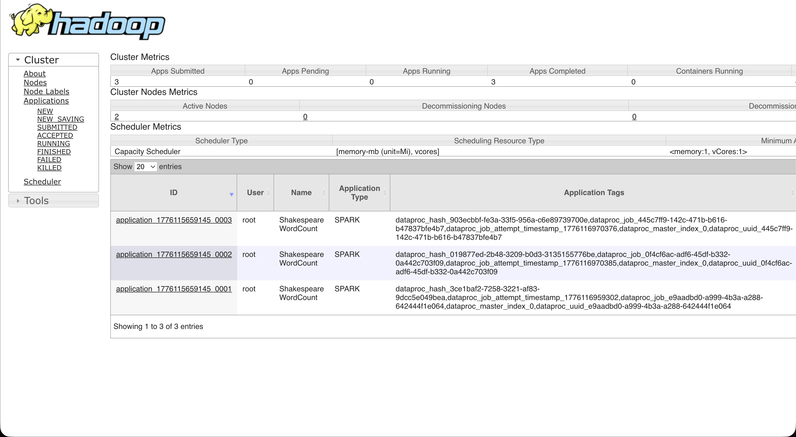
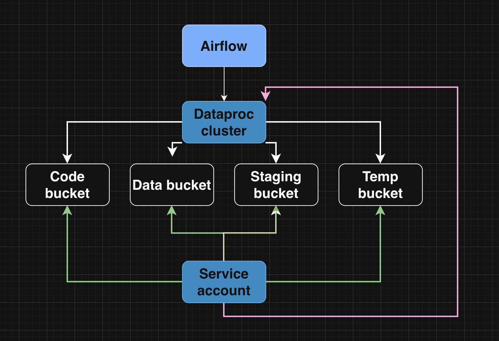

IMPORTANT ❗ ❗ ❗ Please remember to destroy all the resources after each work session. You can recreate infrastructure by creating new PR and merging it to master.

img.png

## Phase 1 Exercise Overview

  Legend

- 🔵 Blue — setup steps (one-time configuration)
- 🟠 Orange — manual steps (GCP Console / GitHub UI)
- 🟢 Green — infrastructure ready
- 🟣 Purple — tasks to complete and document in tasks-phase1.md

1. Authors:
  ***Group number 14***
  [https://github.com/adecku/tbd-workshop-1](https://github.com/adecku/tbd-workshop-1)
2. Follow all steps in README.md.
3. From available Github Actions select and run destroy on master branch.
4. Create new git branch and:
  1. Modify tasks-phase1.md file.
  2. Create PR from this branch to **YOUR** master and merge it to make new release.
    *place the screenshot from GA after successful application of release***
5. Analyze terraform code. Play with terraform plan, terraform graph to investigate different modules.
  ***describe one selected module and put the output of terraform graph for this module here***  
  Graph for dataproc module:   
  ```subgraph "cluster_module.dataproc" {
  subgraph "cluster_module.dataproc" {
      label = "module.dataproc"
      fontname = "sans-serif"
      "module.dataproc.google_dataproc_cluster.tbd-dataproc-cluster" [label="google_dataproc_cluster.tbd-dataproc-cluster"];
      "module.dataproc.google_project_iam_member.dataproc_bigquery_data_editor" [label="google_project_iam_member.dataproc_bigquery_data_editor"];
      "module.dataproc.google_project_iam_member.dataproc_bigquery_user" [label="google_project_iam_member.dataproc_bigquery_user"];
      "module.dataproc.google_project_iam_member.dataproc_worker" [label="google_project_iam_member.dataproc_worker"];
      "module.dataproc.google_project_service.dataproc" [label="google_project_service.dataproc"];
      "module.dataproc.google_service_account.dataproc_sa" [label="google_service_account.dataproc_sa"];
      "module.dataproc.google_storage_bucket.dataproc_staging" [label="google_storage_bucket.dataproc_staging"];
      "module.dataproc.google_storage_bucket.dataproc_temp" [label="google_storage_bucket.dataproc_temp"];
      "module.dataproc.google_storage_bucket_iam_member.staging_bucket_iam" [label="google_storage_bucket_iam_member.staging_bucket_iam"];
      "module.dataproc.google_storage_bucket_iam_member.temp_bucket_iam" [label="google_storage_bucket_iam_member.temp_bucket_iam"];
    }
  ```
  The dataproc module is responsible for setting up a data processing environment in Google Cloud. It creates a Dataproc cluster that can run Spark jobs, along with a service account that has permissions to access resources like BigQuery and Cloud Storage. The module also creates two GCS buckets for staging and temporary data used during job execution. Additionally, it enables the Dataproc API required for the cluster to function. Overall, the module prepares all components needed to process data in the cloud.
6. Reach YARN UI
  ***place the command you used for setting up the tunnel, the port and the screenshot of YARN UI here***
   Hint: the Dataproc cluster has `internal_ip_only = true`, so you need to use an IAP tunnel.
   See: `gcloud compute ssh` with `-- -L <local_port>:localhost:<remote_port>` and `--tunnel-through-iap` flag.
   YARN ResourceManager UI runs on port **8088**.  
  Command used for setting up the tunnel:  
  ```
  gcloud compute ssh tbd-cluster-m  
    --zone europe-west1-b  
    --tunnel-through-iap  
    -- -L 18088:tbd-cluster-m:8088  
  Port: 18088  
  ```
  Screenshot of YARN UI:  
  
7. Draw an architecture diagram (e.g. in draw.io) that includes:
  1. Description of the components of service accounts
  2. List of buckets for disposal
    Diagram:
    
8. Create a new PR and add costs by entering the expected consumption into Infracost

For all the resources of type: `google_artifact_registry_repository`, `google_storage_bucket`
create a sample usage profiles and add it to the Infracost task in CI/CD pipeline. Usage file [example](https://github.com/infracost/infracost/blob/master/infracost-usage-example.yml)

   Expected consumption entered into Infracost usage file:

- google_artifact_registry_repository.registry: 3 GB stored
- google_storage_bucket.tbd-code-bucket: 1 GB stored, 200 Class A ops/month, 1000 Class B ops/month, 1 GB retrieval/month, 1 GB egress/month
- google_storage_bucket.tbd-data-bucket: 10 GB stored, 500 Class A ops/month, 3000 Class B ops/month, 5 GB retrieval/month, 2 GB egress/month
- google_storage_bucket.dataproc_staging: 5 GB stored, 500 Class A ops/month, 2000 Class B ops/month, 2 GB retrieval/month, 1 GB egress/month
- google_storage_bucket.dataproc_temp: 5 GB stored, 500 Class A ops/month, 2000 Class B ops/month, 2 GB retrieval/month, 1 GB egress/month

   ***place the screenshot from infracost output here***

1. Find and correct the error in spark-job.py
  After `terraform apply` completes, connect to the Airflow cluster:
    Then check the external IP (AIRFLOW_EXTERNAL_IP) of the webserver service:
    kubectl get svc -n airflow airflow-webserver  
    ▎ Note: If EXTERNAL-IP shows , wait a moment and retry — LoadBalancer IP allocation may take 1-2 minutes.  
    DAG files are synced automatically from your GitHub repo via git-sync sidecar.
    Airflow variables and the `google_cloud_default` GCP connection are also configured by Terraform.
    a) In the Airflow UI ([http://AIRFLOW_EXTERNAL_IP:8080](http://AIRFLOW_EXTERNAL_IP:8080), login: admin/admin), find the `dataproc_job` DAG, unpause it and trigger it manually.
    ***place a screenshot of the DAG in the Airflow UI***
    b) The DAG will fail. Examine the task logs in the Airflow UI to find the root cause.
    ***paste the relevant error message from the Airflow task log***
    ***describe what the error is and how you found it***
    c) Fix the error in `modules/data-pipeline/resources/spark-job.py` and re-upload the file to GCS:
    Then trigger the DAG again from the Airflow UI.
    ***paste the link to the fixed file***
    d) Verify the DAG completes successfully and check that ORC files were written to the data bucket:
    ***place a screenshot of the successful DAG run in Airflow UI***
2. Create a BigQuery dataset and an external table using SQL
  Using the ORC data produced by the Spark job in task 9, create a BigQuery dataset and an external table.
    Note: the dataset must be created in the same region as the GCS bucket (`europe-west1`), e.g.:
    ***place the SQL code and query output here***
    ***why does ORC not require a table schema?***
3. Add support for preemptible/spot instances in a Dataproc cluster
  ***place the link to the modified file and inserted terraform code***
4. Triggered Terraform Destroy on Schedule or After PR Merge. Goal: make sure we never forget to clean up resources and burn money.

Add a new GitHub Actions workflow that:

1. runs terraform destroy -auto-approve
2. triggers automatically:
  a) on a fixed schedule (e.g. every day at 20:00 UTC)
   b) when a PR is merged to master containing [CLEANUP] tag in title

Steps:

1. Create file .github/workflows/auto-destroy.yml
2. Configure it to authenticate and destroy Terraform resources
3. Test the trigger (schedule or cleanup-tagged PR)

Hint: use the existing `.github/workflows/destroy.yml` as a starting point.

***paste workflow YAML here***

***paste screenshot/log snippet confirming the auto-destroy ran***

***write one sentence why scheduling cleanup helps in this workshop***